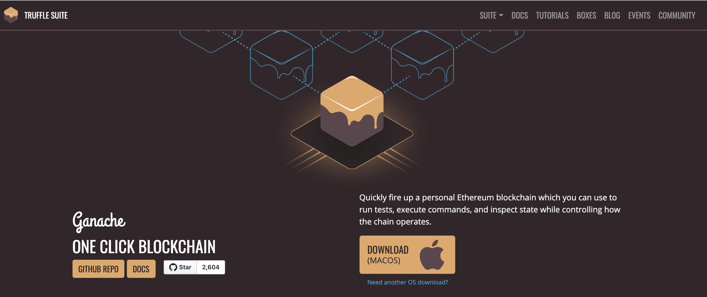
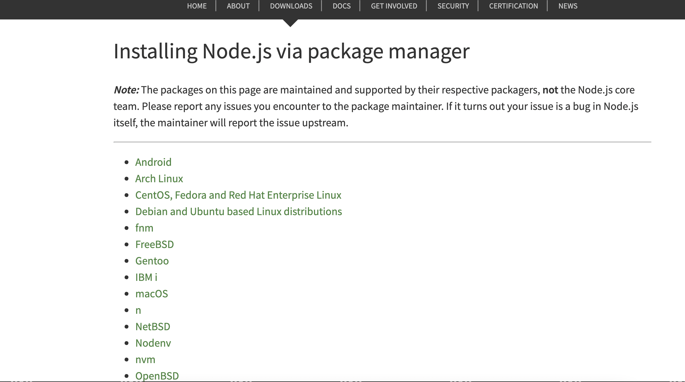
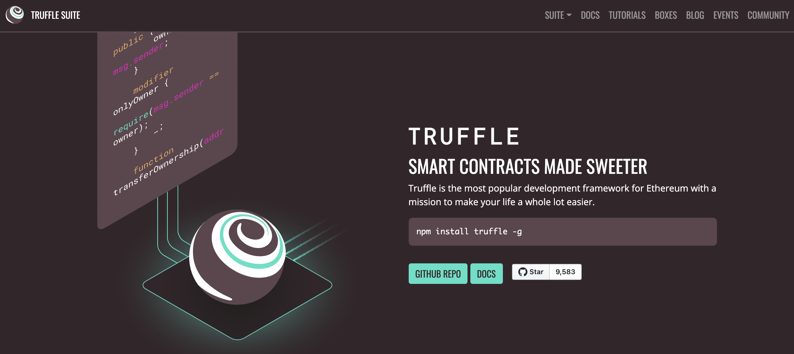
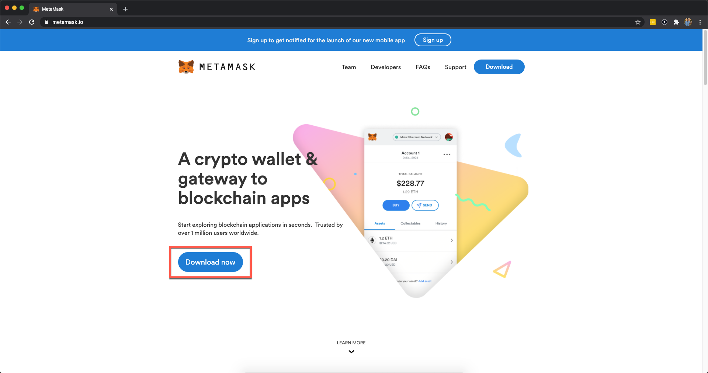
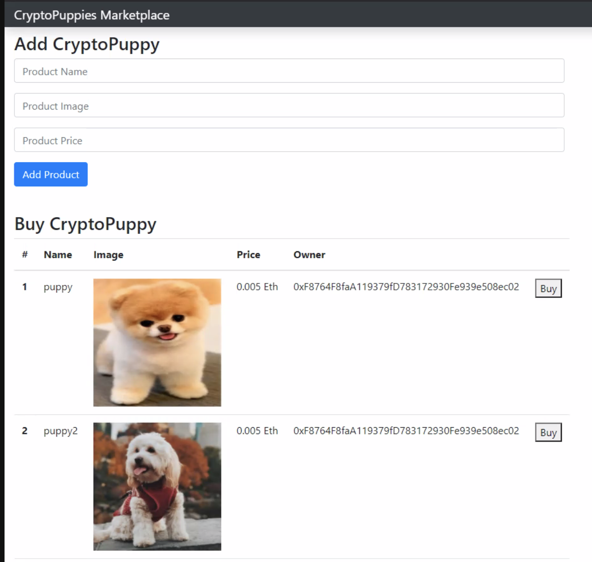

# **Blockchain Market**
### Demo App
Click [here](https://harishkumarchandra.github.io/Crypto_Puppy/) to launch the CryptoPuppies application.


We are designing a decentralized marketplace which can be further extended to meet specific requirements. Moreover, we are developing smart contracts of this marketplace to be deployed on the Ethereum blockchain. Also, we are develing a backend to interact with the smart contracts of the marketplace. 

### **Below we describe development tools used.**
For the development of smart contracts for decentralized marketplace, we are using Solidity programming language, which is the most popular contract-oriented language for Ethereum. 

In order to compile, deploy, and test our Solidity smart contracts, we used the Truffle IDE to test and deploy contracts. This framework is easy to use, and smart contracts can be compiled and deployed using simple commands. Truffle is compatible with live blockchain test networks, which can be used for deployment of smart contracts.

For testing purposes, we used Ganache, a personal Ethereum blockchain that was created by Truffle developers. The friendly UI of Ganache made it easy for us to observe the process and transactions during testing.

### **Blockchain. What is it?**
A blockchain is a peer-to-peer network of computers or nodes, that talk to each other. It is a distributed network where all the participants share the responsibility of running the network. Moreover, each network participant maintains a copy of the code and data of the blockchain. All of this data is contained in bundles of records called "blocks"  which are chained together to make up the blockchain. All of the nodes on the network ensure that this data is secure and unchangeable, unlike a centralized application where the code and data can be changed at any time.  

### **Smart Contract. What is it?**
Smart contracts are written in a programming language called Solidity, which is similar to JavaScript. All of the code in the smart contract is unchangeable or inmmutable. Once deployed to the blockchain we won't be able to change it. This feature is to make sure that the code is secure.

### **Installing Dependencies**
Now let's install all of the dependenes we need to buid out project. Frist, we need to set up a personal blockchain to develop the applicaton locally.

### **Ganache Personal Blockchain**
The dependency is a personal blockchain, which is a local development blockchain that we can used to recreate the behavior of a public blockchain. In this case we will use [Ganache](https://www.trufflesuite.com/ganache) as our personal blockchain for Ethereum development. It will allow us to deploy smart contracts,develop applications and run tests. it is available on Linux, Mac and Windows as a desktop application and a command line tool.




Photo or gif of opened ganache

### **Node JS**
Now that you have Ganache running, you will need to configure the environment for developing smart contracts. The first dependency that we need is [Node Package Manager](https://nodejs.org/en/download/package-manager/) which comes with Node.js 
You can check if you have node already installed by going to your terminal and tying: ```node -v```



### **Truffle** 

Now we need to install the [Truffle Framework](https://www.trufflesuite.com/truffle) which will provide us a suite of tools for developing Ethereum smart contracts with Solidity programing language.


The Truffle Framework provides all the following functionalities: 

* Smart Contract Management
* Automated Testing
* Deployment & Migrations
* Network Management
* Development Console 
 
### **MetaMask** 

Finally we need to install [MetaMask](https://metamask.io) is a web browser extension that allows you to run Ethereum dApps right in your browser without running a full Ethereum node. 




### **Below we describe our project: CryptoPuppies Marketplace**



This is a marketplace that runs on the blockchain. It allows individuals to list "CryptoPuppies" for sale and to purchase them on the website with cryptocurrency. This application is powered by a smart contract on the blockchain which manages the market place. For example it tracks who owns the "CryptoPuppy" for sale, and it automatically transfers the ownership of it when a transaction is complete.

### **Ropsten Ethereum**

One of our main goals was to be able to run our application on Ropsten Ethereum. Ropsten Ethereum is also known as Ethereum Testnet -- a testing network that runs the same protocol as Ethereum does and is used to testing purposes before deploying on the main network. Using Ropsten to deploy our application allows for greater interactability among users. 

### **Sources**
* [How To Build A Blockchain App ](https://www.dappuniversity.com/articles/how-to-build-a-blockchain-app#dependencies)
* [Get Ropsten Ethereum](https://medium.com/bitfwd/get-ropsten-ethereum-the-easy-way-f2d6ece21763)
